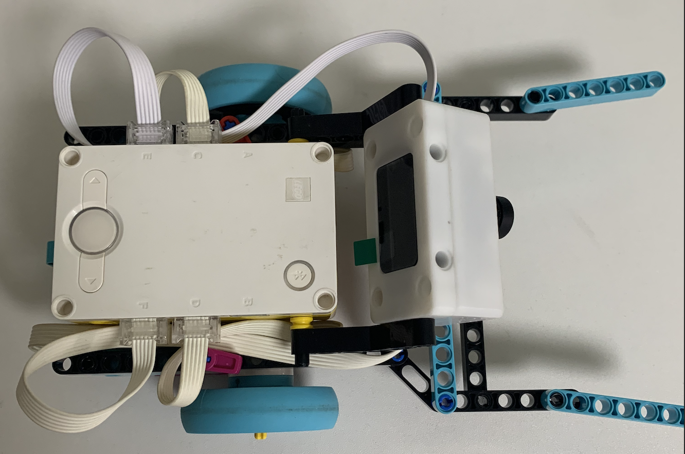
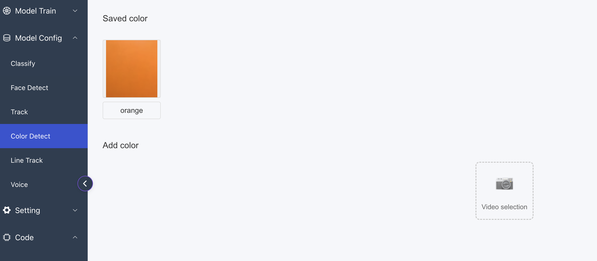
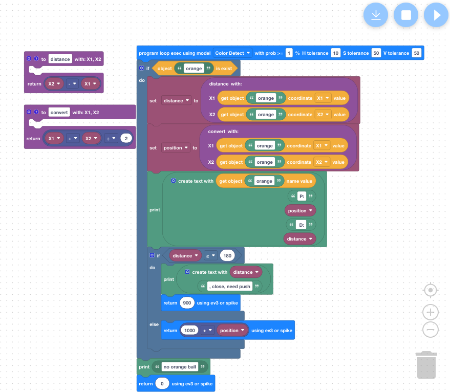

# Ball Tracking Robot for LEGO® SPIKE™ Prime 

This project demonstrates how to use the **SenrayVar AI Camera** to build an autonomous robot that can identify, track, and clear balls from a field.

---

## 🔌 Hardware Connections

Connect your components to the SPIKE Prime Hub as follows:

* **Port C & D:** Drive Motors (Left & Right)
* **Port E:** SenrayVar AI Camera
* **Port F:** LEGO Color Sensor (for boundary detection)


*Figure 1: Overall hardware connection and robot build.*

---

## ⚙️ Camera App Configuration

To make the robot work with the provided code, configure your camera in the **SenrayVar App**:

1.  **Mode:** Select `Codel config -> Color Detect`.
2.  **orange:** Train for **Orange Ball**.

<p align="center">
  
</p>
<p align="center"><em>Figure 2: Camera App color training settings.</em></p>

---

## 📝 Camera App Logic & Data Handling

The **SenrayVar AI Camera** communicates with the SPIKE Prime Hub by emulating a **Distance Sensor (Ultrasonic)**. To maximize data precision and range, please note the following protocol details:

### 🔢 Data Protocol & Range:
* **Protocol Limit:** The transmission uses a 16-bit signed integer, meaning the maximum positive value is **32,767**.
* **Unit Setting (Crucial):** * If the camera is set to **cm**[default], the Hub effectively sees a max range of **3,276.7** (due to the 0.1cm resolution).
    * By setting the camera unit to **mm**, you can transmit the full integer range up to **32,767** directly to the SPIKE Hub.
* **Data Size:** Limited to **2 bytes** per transmission packet.

### 🧠 On-Camera Logic Processing:
To package multiple data points (Ball Type + Position) into a single "Distance" value, the camera uses the following encoding logic:

* **Encoding Formula:** `(Ball_Type * 1000) + Ball_X_Position`
* **Example:** * Orange Ball (ID 1) at center (400) → Camera sends **1400**.
    * Purple Ball (ID 2) at right (750) → Camera sends **2750**.
* **Special Trigger:** A value of **900** is sent to signal a "Push" command.

**Camera Logic Script Configuration:**


*Figure 3: Internal scratch code in the SenrayVar Web/App processing.*

---

## 📝 SPIKE Prime Python Code

Copy the code below into your SPIKE Prime App (Python project):

```bash
import runloop
import motor_pair
import distance_sensor
import color_sensor
import color
from hub import port, motion_sensor
from app import display

# ==========================================
# Initialization & Configuration
# ==========================================
# Pair the left motor (Port C) and right motor (Port D) as PAIR_1
motor_pair.pair(motor_pair.PAIR_1, port.C, port.D)

# Initialize the robot's starting orientation as 0 degrees (forward)
motion_sensor.reset_yaw(0)

# ==========================================
# Helper Function: Align Yaw
# ==========================================
async def align_to_yaw(target_yaw_deg):
    """
    Rotates the robot in place to precisely align with a specific target angle.
    """
    # motion_sensor.tilt_angles() returns values in "deci-degrees" (1/10th of a degree)
    target_yaw_deci = target_yaw_deg * 10

    while True:
        # Get the current Yaw angle (index 0)
        current_yaw_deci = motion_sensor.tilt_angles()[0]

        # Calculate error and wrap it between -1800 and 1800 (-180 to 180 degrees)
        error_deci = target_yaw_deci - current_yaw_deci
        error_deci = (error_deci + 1800) % 3600 - 1800

        # If error is less than 2 degrees (20 deci-degrees), stop and break
        if abs(error_deci) <= 20:
            motor_pair.stop(motor_pair.PAIR_1)
            break

        # Proportional (P) control for rotation speed
        turn_speed = int(error_deci / 5)
        turn_speed = max(-100, min(100, turn_speed)) # Clamp speed to limits

        # Perform tank turn (one side forward, one side reverse)
        motor_pair.move_tank(motor_pair.PAIR_1, -turn_speed, turn_speed)
        await runloop.sleep_ms(10)

# ==========================================
# Main Program Loop
# ==========================================
async def main():
    while True:
        # Get value from distance sensor (Port E) converted to cm/scaled units
        esensor_value = int(distance_sensor.distance(port.E)/10)

        # Skip loop iteration if no valid sensor reading is detected
        if esensor_value == -1:
            await runloop.sleep_ms(10)
            continue

        # Parse sensor data: 1000s digit = ball type, remainder = position
        ball_type = esensor_value // 1000  # 1 for Orange, 2 for Purple
        ball_pos = esensor_value % 1000    # Range 0-800, where 400 is center

        # Detect close-range "push" signal (value 900)
        if esensor_value == 900 or ball_pos == 900:

            # 1. Straighten robot to face original front (0 degrees)
            display.text(str("align_to_yaw"))
            await align_to_yaw(0)
            display.text(str("align_to_yaw after"))

            # 2. High acceleration push until color sensor detects Black
            # Velocity 660, Max acceleration 10000
            motor_pair.move(motor_pair.PAIR_1, 0, velocity=660, acceleration=10000)

            # Wait until Port F detects BLACK color
            while color_sensor.color(port.F) != color.BLACK:
                await runloop.sleep_ms(1)
            motor_pair.stop(motor_pair.PAIR_1)

            # 3. Reverse until the color sensor detects a black line again
            motor_pair.move(motor_pair.PAIR_1, 0, velocity=-500)
            # 1s buffer to move away from current line and avoid immediate trigger
            await runloop.sleep_ms(1000)

            display.text(str("push"))

            # Wait for next black line detection
            while color_sensor.color(port.F) != color.BLACK:
                await runloop.sleep_ms(10)
            motor_pair.stop(motor_pair.PAIR_1)

            # 4. Turn around and prepare for next ball detection
            # Perform a 180-degree turn via align function
            await align_to_yaw(0)
            # Reset orientation so the new direction is considered 0 degrees
            motion_sensor.reset_yaw(0)

        # Tracking logic for Orange Ball
        elif ball_type == 1:
            # Calculate deviation from center (400)
            error = ball_pos - 400

            # Map 0-800 deviation to steering values -100 to 100
            steering = int(error / 4)
            steering = max(-100, min(100, steering))

            # Drive toward the ball using the calculated steering
            motor_pair.move(motor_pair.PAIR_1, steering, velocity=400)

        # Stop if Purple ball (2) or No ball (0) detected
        elif ball_type == 2 or esensor_value == 0:
            motor_pair.stop(motor_pair.PAIR_1)

        # Brief pause to yield control to the event loop
        await runloop.sleep_ms(50)

# Start the program
runloop.run(main())

```