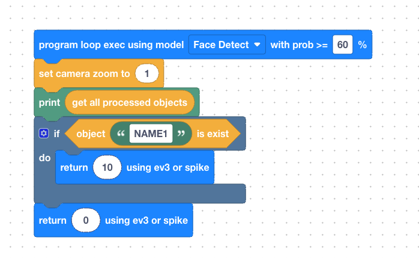
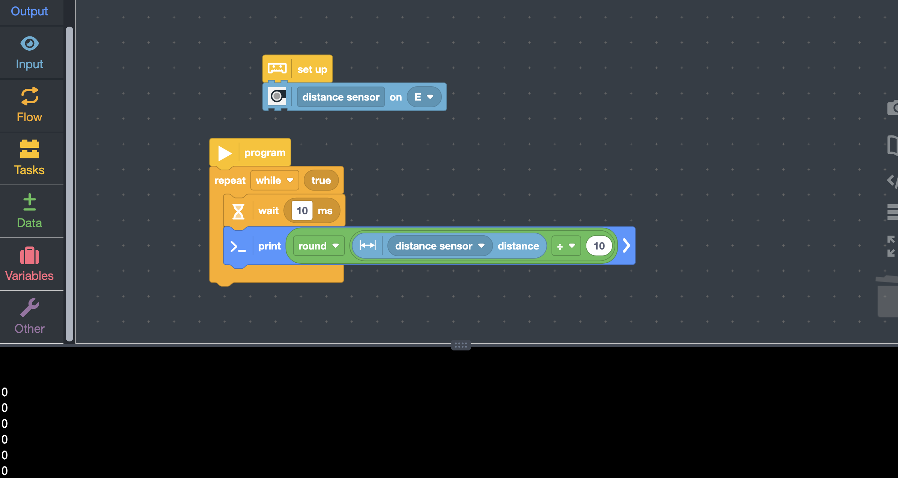

# Face Detect Demo for LEGO SPIKE Prime 

This project demonstrates how to use the **SenrayVar AI Camera** to detect face

---

## 🔌 Hardware Connections

Connect your components to the SPIKE Prime Hub as follows:

* **Port E:** SenrayVar AI Camera

---

## 📝 Camera App Logic & Data Handling

The **SenrayVar AI Camera** communicates with the SPIKE Prime Hub by emulating a **Distance Sensor (Ultrasonic)**. To ensure successful data integration, please note that the available data range and behavior change depending on your programming environment:

---

### 🔢 Data Protocol & Range

The transmission uses a **16-bit signed integer** (2 bytes per packet). However, the SPIKE Hub processes this data differently based on the language used:

| Programming Environment | Effective Data Range | Description |
| :--- | :--- | :--- |
| **Scratch (Blocks)** | **0 to 200** | The Hub automatically scales and clamps the sensor value to a standard 0-200 range. |
| **Python (cm unit default)** | **-32,76 to 32,76** | Provides access to the **raw 16-bit integer**, allowing for full precision and data packing. |
| **Python (mm unit 3.10 version)** | **-32,768 to 32,767** | Provides access to the **raw 16-bit integer**, allowing for full precision and data packing. |
---

### 🧠 On-Camera Logic Processing

To maximize data density, you can package multiple data points (such as Object ID + X/Y Coordinates) into a single "Distance" value. 


## 📝 Camera APP Configuration:
**1. Camera Model Configuration:**  
  a.  **Mode Config:** Select `Model config -> Face Detect -> Video selection`.  
  b.  **NAME_1:** Train for **NAME_1**, you can modify the name.

<p align="center">
  
</p>
<p align="center"><em>Figure 1: Camera App face training settings.</em></p>

**2. Camera Code:**  

<p align="center"><em>Figure 2: Internal scratch code in the SenrayVar Web/App.</em></p>

    On the LEGO side, 
    if the face NAME_1 is detected, a value of 10 is received; 
    otherwise, a value of 0 is received.
---

## 📝 Pybrick Code

### python
```
from pybricks.hubs import PrimeHub
from pybricks.pupdevices import Motor, ColorSensor, UltrasonicSensor, ForceSensor
from pybricks.parameters import Button, Color, Direction, Port, Side, Stop
from pybricks.robotics import DriveBase
from pybricks.tools import wait, StopWatch

hub = PrimeHub()

dist_sensor = UltrasonicSensor(Port.E)

while True:
    distance_mm = dist_sensor.distance()
    # convert t0 (cm)
    distance_cm = int(distance_mm / 10)
    print("value:", distance_cm, "cm")
    wait(100)

```

<p align="center"><em>Figure 3: Running Log</em></p>


### scratch

<p align="center"><em>Figure 4: Scratch Code And Log</em></p>