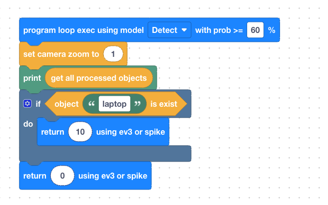

# Object Detect for LEGO SPIKE Prime

This project demonstrates how to use the **SenrayVar AI Camera** to detect objects

---

## 📦 Supported Object Detection (COCO 80 Classes)

The **SenrayVar AI Camera** comes pre-installed with a highly optimized YOLOV8-based model trained on the COCO (Common Objects in Context) dataset. It can identify **80 different classes** of objects. When an object is detected, the camera provides the Class ID() and the specific coordinates ($x, y, w, h$) via the serial port.

### COCO Object List

| category | detectable objects |
| :--- | :--- |
| **person** | person |
| **vehicles** | bicycle, car, motorcycle, airplane, bus, train, truck, boat |
| **outdoor** | traffic light, fire hydrant, stop sign, parking meter, bench |
| **animals** | bird, cat, dog, horse, sheep, cow, elephant, bear, zebra, giraffe |
| **accessories** | backpack, umbrella, handbag, tie, suitcase |
| **sports** | frisbee, skis, snowboard, **sports ball**, kite, baseball bat, baseball glove, skateboard, surfboard, tennis racket |
| **kitchenware** | bottle, wine glass, cup, fork, knife, spoon, bowl |
| **food** | banana, apple, sandwich, orange, broccoli, carrot, hot dog, pizza, donut, cake |
| **furniture** | chair, couch, potted plant, bed, dining table, toilet |
| **electronics** | tv, laptop, mouse, remote, keyboard, cell phone |
| **appliances** | microwave, oven, toaster, sink, refrigerator |
| **indoor items** | book, clock, vase, scissors, teddy bear, hair drier, toothbrush |

---


## 🔌 Hardware Connections

Connect your components to the SPIKE Prime Hub as follows:

* **Port E:** SenrayVar AI Camera

---

## 📝 Camera App Logic & Data Handling

The **SenrayVar AI Camera** communicates with the SPIKE Prime Hub by emulating a **Distance Sensor (Ultrasonic)**. To ensure successful data integration, please note that the available data range and behavior change depending on your programming environment:

---

### 🔢 Data Protocol & Range

The transmission uses a **16-bit signed integer** (2 bytes per packet). However, the SPIKE Hub processes this data differently based on the language used:

| Programming Environment | Effective Data Range | Description |
| :--- | :--- | :--- |
| **Scratch (Blocks)** | **0 to 200** | The Hub automatically scales and clamps the sensor value to a standard 0-200 range. |
| **Python (cm unit default)** | **-32,76 to 32,76** | Provides access to the **raw 16-bit integer**, allowing for full precision and data packing. |
| **Python (mm unit 3.10 version)** | **-32,768 to 32,767** | Provides access to the **raw 16-bit integer**, allowing for full precision and data packing. |
---

### 🧠 On-Camera Logic Processing

To maximize data density, you can package multiple data points (such as Object ID + X/Y Coordinates) into a single "Distance" value. 


## 📝 Camera APP Configuration:
**1. Camera Model Configuration:**  
  No configuration required

**2. Camera Code:**  

<p align="center"><em>Figure 1: Internal scratch code in the SenrayVar Web/App.</em></p>

**Replace `lattop` with the name of the object you want to identify, and you can view the output printed in the interface.**

---

## 📝 Pybrick Code

### python
```
from pybricks.hubs import PrimeHub
from pybricks.pupdevices import Motor, ColorSensor, UltrasonicSensor, ForceSensor
from pybricks.parameters import Button, Color, Direction, Port, Side, Stop
from pybricks.robotics import DriveBase
from pybricks.tools import wait, StopWatch

hub = PrimeHub()

dist_sensor = UltrasonicSensor(Port.E)

while True:
    distance_mm = dist_sensor.distance()
    # convert t0 (cm)
    distance_cm = int(distance_mm / 10)
    print("value:", distance_cm, "cm")
    wait(100)

```

<p align="center"><em>Figure 3: Running Log</em></p>

### scratch

<p align="center"><em>Figure 4: Scratch Code And Log</em></p>
